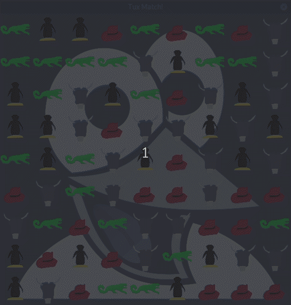

# Tux Match!
A match three game.

 [Watch demo on YouTube](https://www.youtube.com/watch?v=-3QSgVSLt3M)

## Dependencies

This app needs OpenGL4 or OpenGL-ES3.0 or higher, and Qt5. It was developed on Fedora 30,
but should run on any OS supported by Qt5, including Android, iOS and even webbrowsers.

## Assets

I created the game pieces myself, as should be clear from their "artistic" quality.
To accent my work, I use the great font "Chalk Dash" font, which is free for non-commercial use, more information [here](https://www.dafont.com/chalk-dash.font).
The background image is creative commons.
